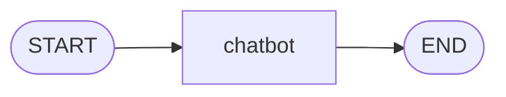
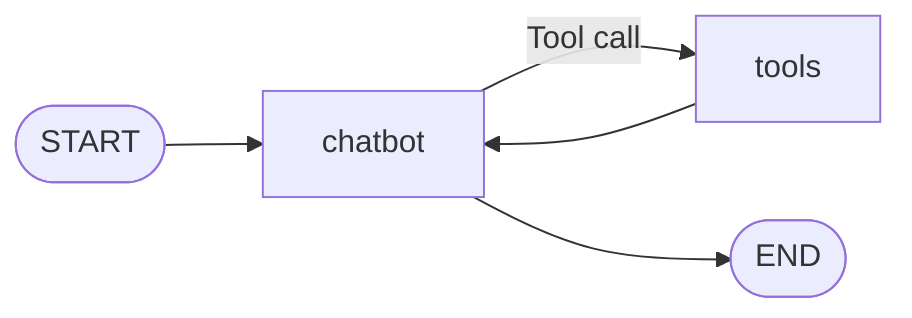
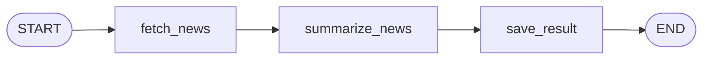

# Agentic Chatbots

A Streamlit application that demonstrates three agentic workflows built with LangGraph and a Groq-hosted chat model:

- **Basic Chatbot** — a single LLM chatbot node.
- **Chatbot With Web** — an LLM chatbot that conditionally calls a Tavily search tool.
- **AI News** — a workflow that fetches AI news, summarizes it, and saves a Markdown digest.

## Project Overview

The application entry point is `app.py`, which loads the Streamlit application from `src/langgraphagenticai/main.py`. The UI lets a user select a Groq model and one of the three supported use cases. `GraphBuilder` then builds and compiles the matching LangGraph workflow.

## Workflows

### 1. Basic Chatbot

`BasicChatbotNode.process` passes the current `messages` state to the configured LLM and returns the LLM response as the updated message state.



Graph construction: `START → chatbot → END`.

### 2. Chatbot With Web

The chatbot is bound to the configured tools. The graph uses LangGraph's `tools_condition` to decide whether the chatbot should end or execute the `tools` node. After a tool call, the graph returns to the chatbot node so the LLM can produce a final answer.



The current tool factory creates a Tavily search tool with `max_results=2`.

### 3. AI News

The AI News graph uses the selected time frame as input, fetches AI news through Tavily, summarizes the retrieved articles with the LLM, and saves the result to `AINews/<frequency>_summary.md`.



The Streamlit UI offers **Daily**, **Weekly**, and **Monthly** time frames. The summary prompt requests date-ordered Markdown items with a source link.

## Technology

- Python 3.12+
- Streamlit
- LangGraph
- LangChain and LangChain Groq
- Tavily Search
- python-dotenv

## Repository Structure

```text
Agentic-Chatbot/
├── AINews/                              # Generated AI news summaries
├── src/
│   └── langgraphagenticai/
│       ├── LLMS/groqllm.py              # Groq model initialization
│       ├── graph/graph_builder.py       # LangGraph workflow construction
│       ├── nodes/                       # Chatbot and AI news nodes
│       ├── state/state.py               # Shared graph state
│       ├── tools/search_tool.py          # Tavily tool construction
│       ├── ui/                           # Streamlit configuration and rendering
│       └── main.py                       # Streamlit application orchestration
├── app.py                                # Streamlit entry point
├── requirements.txt
└── pyproject.toml
```

## Setup

### 1. Clone the repository

```bash
git clone https://github.com/JayantPrakash/Agentic-Chatbot.git
cd Agentic-Chatbot
```

### 2. Create and activate a virtual environment

**macOS / Linux**

```bash
python -m venv .venv
source .venv/bin/activate
```

**Windows PowerShell**

```powershell
python -m venv .venv
.\.venv\Scripts\Activate.ps1
```

### 3. Install dependencies

```bash
pip install -r requirements.txt
```

### 4. Configure environment variables

Create a `.env` file in the repository root:

```dotenv
GROQ_API_KEY=your_groq_api_key
TAVILY_API_KEY=your_tavily_api_key
```

`GROQ_API_KEY` is required by the Groq LLM wrapper. `TAVILY_API_KEY` is read by the AI News workflow.

### 5. Start the application

```bash
streamlit run app.py
```

## Using the Application

1. Choose **Groq** and select a model in the sidebar.
2. Select one of the available use cases:
   - **Basic Chatbot**: Enter a message in the chat input.
   - **Chatbot With Web**: Enter a question; the graph can invoke the Tavily search tool when the LLM returns a tool call.
   - **AI News**: Select Daily, Weekly, or Monthly, then click **Fetch Latest AI News**.
3. For AI News, the rendered result is also written under the `AINews/` directory as a Markdown file.

## Implementation Notes

- The shared LangGraph `State` contains a `messages` field with LangGraph's `add_messages` reducer.
- `GraphBuilder.setup_graph()` selects the graph for the exact use-case values `Basic Chatbot`, `Chatbot With Web`, and `AI News`, then returns the compiled graph.
- The news query targets AI technology news in India and globally, retrieves up to 20 results, and sends the returned article content, URLs, and publication dates to the summarization prompt.

## Security Note

Do not commit API keys to source control. Before deploying or sharing a fork, rotate any previously exposed key and update `src/langgraphagenticai/tools/search_tool.py` to load the Tavily credential from an environment variable rather than source code.

## Author

[Jayant Prakash](https://github.com/JayantPrakash)
